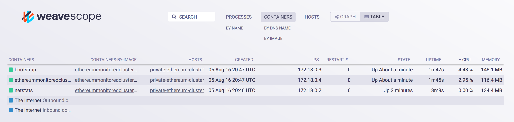
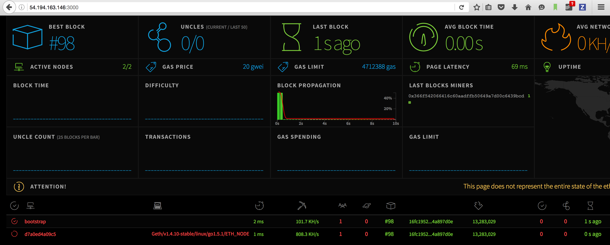
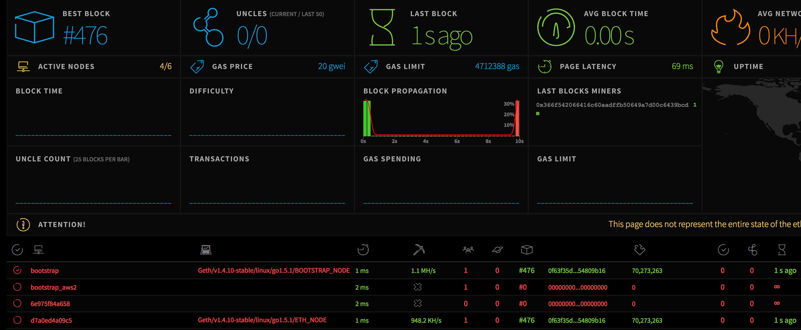

# Ethereum Docker

### Create a docker-machine on AWS 
```
docker-machine create \
     --driver amazonec2 \
     --amazonec2-access-key XXXX \
     --amazonec2-secret-key XXXX \
     --amazonec2-vpc-id XXXX \
     --amazonec2-region eu-west-1 \
     --amazonec2-zone=b \
     --amazonec2-subnet-id subnet-5cd7802b \
     --amazonec2-instance-type m4.2xlarge \
     --amazonec2-root-size 100 \
     private-ethereum-cluster
```
[How to get the AWS parameters](http://docs.aws.amazon.com/AWSSimpleQueueService/latest/SQSGettingStartedGuide/AWSCredentials.html)

logs 

```
Running pre-create checks...
Creating machine...
(private-ethereum-cluster) Launching instance...
Waiting for machine to be running, this may take a few minutes...
Detecting operating system of created instance...
Waiting for SSH to be available...
Detecting the provisioner...
Provisioning with ubuntu(systemd)...
Installing Docker...
Copying certs to the local machine directory...
Copying certs to the remote machine...
Setting Docker configuration on the remote daemon...

Checking connection to Docker...
Docker is up and running!
To see how to connect your Docker Client to the Docker Engine running on this virtual machine, run: docker-machine env private-ethereum-cluster
Je:ethereum-private-daap nabil$ 
Je:ethereum-private-daap nabil$ eval "$(docker-machine env private-ethereum-cluster)"
Je:ethereum-private-daap nabil$ docker ps -a
CONTAINER ID        IMAGE               COMMAND             CREATED             STATUS              PORTS               NAMES
```

### Prepare your docker *ENV* : 
`eval "$(docker-machine env private-ethereum-cluster)"`

### Start Ethereum cluster : 

This will include : 

1. Ethereum Bootstrap Node
2. Ethereum simple Node
3. Monitoring Ethereum server 
4. Scope docker monitroing


`docker-compose up -d`

Open scope Monitoring interface : 
`open http://$(docker-machine ip private-ethereum-cluster):4040`



##### GET THE ENODE ID  : 

`docker-compose logs bootstrap | grep enode://`

```
Je:ethereum-monitored-cluster nabil$ docker-compose logs bootstrap | grep enode://
bootstrap | I0805 20:47:57.764001 p2p/discover/udp.go:217] Listening, enode://bd932fe6e4a8a6e810d55401def9e273523334a146c411d4e260c5fe6ccfc9b87dfd750b7f710505e0f8129d75bbca3fbfbd24515997a598c8e2c8458d1a8bf6@[::]:30303
```

### Create Account on each Node : 

```
docker exec -it bootstrap geth --datadir=~/.ethereum/devchain \
--exec 'admin.addPeer(bootstrapID@bootstrapIP:30303)' \
attach ipc://root/.ethereum/devchain/geth.ipc
```

OPEN ETHSTATS INTERFACE : 

`open http://$(docker-machine ip private-ethereum-cluster):3000`

### Adding Peers : 
On each `eth` node execute the following command : 

```
docker exec -it bootstrap geth --datadir=~/.ethereum/devchain --exec 'personal.newAccount("AZERTY")' attach ipc://root/.ethereum/devchain/geth.ipc
```

```
docker exec -it ethereummonitoredcluster_eth_1 geth --datadir=~/.ethereum/devchain --exec 'personal.newAccount("AZERTY")' attach ipc://root/.ethereum/devchain/geth.ipc
```

```
docker exec -it ethereummonitoredcluster_eth_1 geth --datadir=~/.ethereum/devchain --exec 'admin.addPeer("enode://bd932fe6e4a8a6e810d55401def9e273523334a146c411d4e260c5fe6ccfc9b87dfd750b7f710505e0f8129d75bbca3fbfbd24515997a598c8e2c8458d1a8bf6@172.18.0.3:30303")' attach ipc://root/.ethereum/devchain/geth.ipc
```

```
docker exec -it ethereummonitoredcluster_eth_1 geth --datadir=~/.ethereum/devchain --exec 'admin.peers' attach ipc://root/.ethereum/devchain/geth.ipc
```

```

docker exec -it bootstrap geth --datadir=~/.ethereum/devchain --exec 'admin.peers' attach ipc://root/.ethereum/devchain/geth.ipc

```


### Start Mining 
```
docker exec -it bootstrap geth --datadir=~/.ethereum/devchain --exec 'miner.start()' attach ipc://root/.ethereum/devchain/geth.ipc
```

```
docker exec -it ethereummonitoredcluster_eth_1 geth --datadir=~/.ethereum/devchain --exec 'miner.start()' attach ipc://root/.ethereum/devchain/geth.ipc
```

All is good on a single AWS instance : 



## Join another AWS Ethereum cluster 

let start with a second AWS instance : 

```
docker-machine create \
     --driver amazonec2 \
     --amazonec2-access-key XXXX \
     --amazonec2-secret-key XXXX \
     --amazonec2-vpc-id XXXX \
     --amazonec2-region eu-west-1 \
     --amazonec2-zone=b \
     --amazonec2-subnet-id XXX \
     --amazonec2-instance-type m4.2xlarge \
     --amazonec2-root-size 100 \
     private-ethereum-cluster2
```

start A new Cluster 
and that's it :




```
docker exec -it bootstrap_aws2 geth --datadir=~/.ethereum/devchain --exec 'personal.newAccount("AZERTY")' attach ipc://root/.ethereum/devchain/geth.ipc
```

```
docker exec -it bootstrap_aws2 geth --datadir=~/.ethereum/devchain --exec 'admin.addPeer("enode://bd932fe6e4a8a6e810d55401def9e273523334a146c411d4e260c5fe6ccfc9b87dfd750b7f710505e0f8129d75bbca3fbfbd24515997a598c8e2c8458d1a8bf6@54.194.163.146:30303")' attach ipc://root/.ethereum/devchain/geth.ipc
```

```
docker exec -it bootstrap_aws2 geth --datadir=~/.ethereum/devchain --exec 'admin.peers' attach ipc://root/.ethereum/devchain/geth.ipc
```
